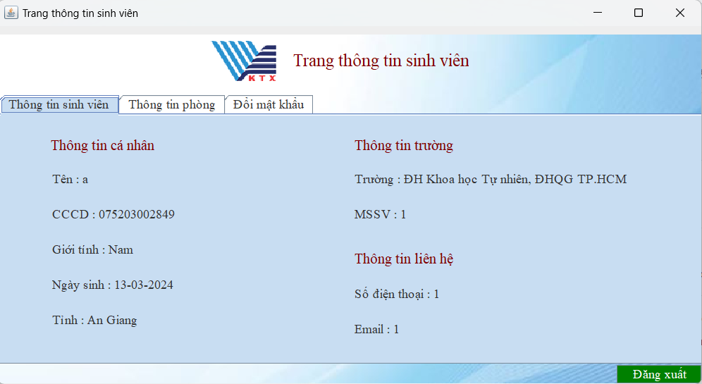
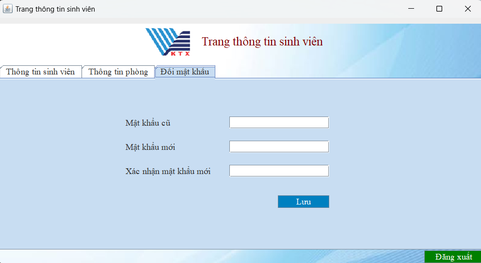

# Dormitory_Management_System
## Introduction
- The system is built to manage registration and login at dormitory for student
- Frontend : Java Swing
- Backend : Java Core

## Feature
- Students can register for dormitory accommodation
- Students can login to dormitory system
- Students can manage personal information 

## Overview
- Main Page (Display when student access to app)

- Registration page (Students can register for rooms on this page)

- Room Information (Studens can view room information before registrating)

- Registration Form (Students fill the form to complete the registration)

- Login Page 

- Student Information 

- Room Information 

- Change Password 

## Video Demo
https://www.youtube.com/watch?v=9n-Rwp1IROM

## How to run
- Install JRE
- Open DormitoryManagement.jar